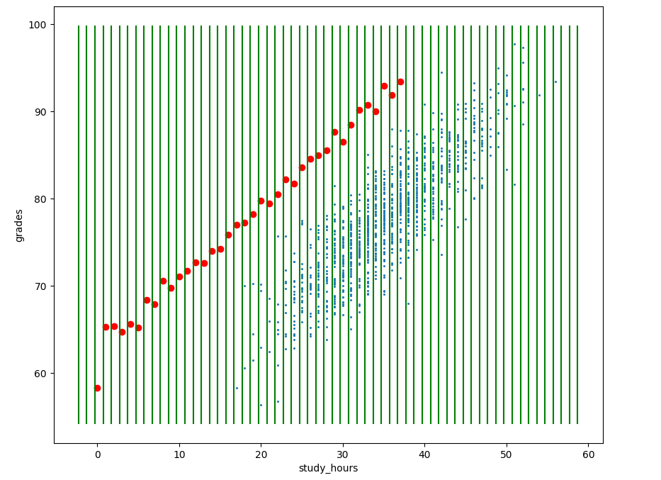
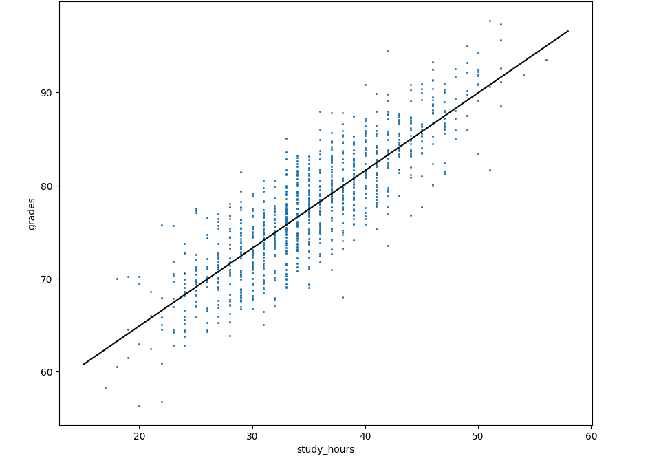

## HW 5 .md is below Regularization

## Regularization ##

## Name and Email: ##
Aaron Campbell
Campbella20@students.ecu.edu

## ---------------------------------------------------------------------------------------------------------

## HW 6

## Name and Email: ##
Aaron Campbell
Campbella20@students.ecu.edu

## hyperparameters:    
    n_estimators=1000,
    max_depth=20,
    min_samples_split=2,
    min_samples_leaf=1,
    criterion='entropy',
    max_features='sqrt'

Initial shape of data: (569, 30)
Shape of selected data: (569, 2)
Average accuracy with selected features: 0.9367
Average accuracy with tuned parameters: 0.9315
Accuracy per feature: 0.4657

## HW 4

---------------------------
## Name and Email: ##
Aaron Campbell
Campbella20@students.ecu.edu

--------------------

Tuning Linear Regression...
Linear Regression training score: 0.0688
Tuning Lasso...
Best alpha for Lasso: 0.23357214690901212
Best cross-validation score: 0.0680
Tuning Ridge...
Best alpha for Ridge: 10000.0
Best cross-validation score: 0.0680

Evaluating Linear Regression...
Mean Squared Error: 5248.2257
R²: -0.0053

Evaluating Lasso...
Mean Squared Error: 5242.1844
R²: -0.0041

Evaluating Ridge...
Mean Squared Error: 5246.5127
R²: -0.0049

Best model: Lasso

## I believe the low R squared values are because of the missing values in the data tables. 